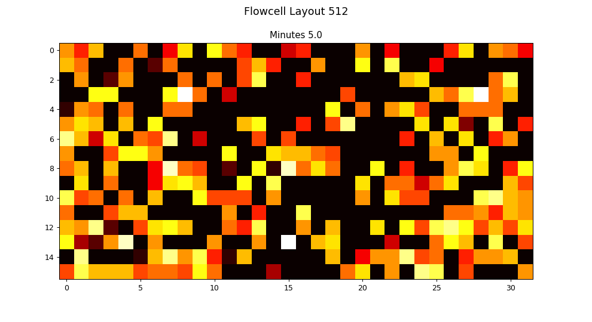

# Flowcellvis

This little script generates an animated gif for flowcell layout from a sequencing_summary.txt file generated by Oxford Nanopore Guppy or Albacore basecallers.

It isn't particularly fast and it assumes that the sequencing summary file contains a single run_id. If you have stopped and restarted a run then the script will sort these out, but the ordering of the individual runs isn't yet correct.

gifs are automatically sized to either 512 (MinION/GridION) or 3000 (PromethION) channel flowcells.

A MinION example:

A PromethION example:

## Installation

This is a Python3 script. To install we suggest using a virtual environment:

    python3 -m venv /path/to/virtual/env
    . /path/to/virtual/env/bin/activate

Then install the requirements (matplotlib, pandas)

    pip install -r requirements.txt

This script also uses imagemagick to render the gif.

On OSX install with brew:
  
    brew install imagemagick
    
For other platforms look here:

https://www.imagemagick.org/script/download.php

## Running

To generate the example plots use:

    python flowcellgif.py --input examples/MinION_example.txt --output MinION.gif
    
    python flowcellgif.py --input examples/PromethION_example.txt --output PromethION.gif
   
For your own files:

    python flowcellgif.py --input path/to/your/sequencing_summary.txt --output yourfile.gif
   
Please note that the example files have been cut in size and the run_ids edited. The example GIFs are not illustrative of general Nanopore performance on any platform. 
